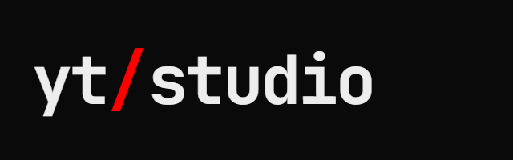
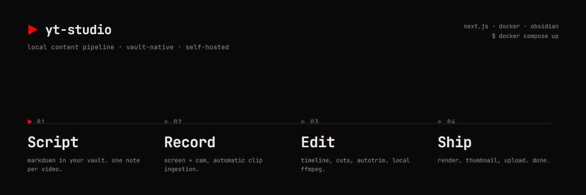
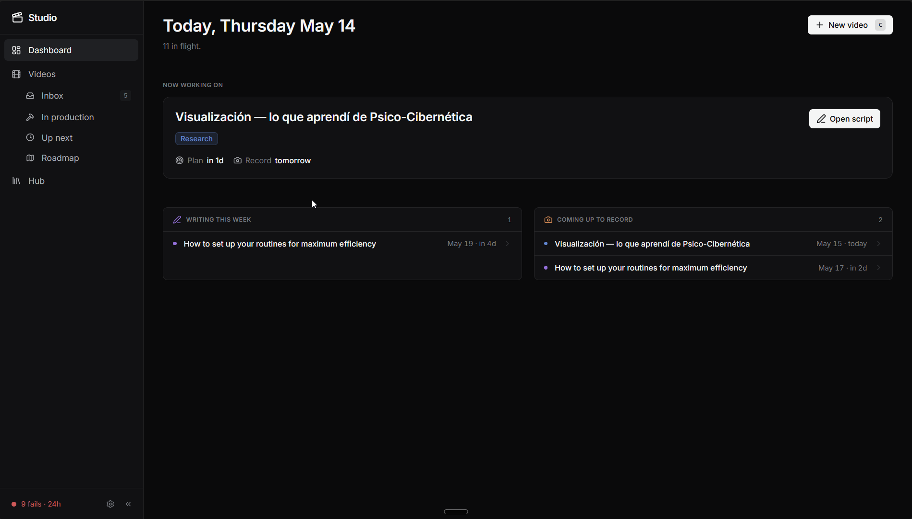
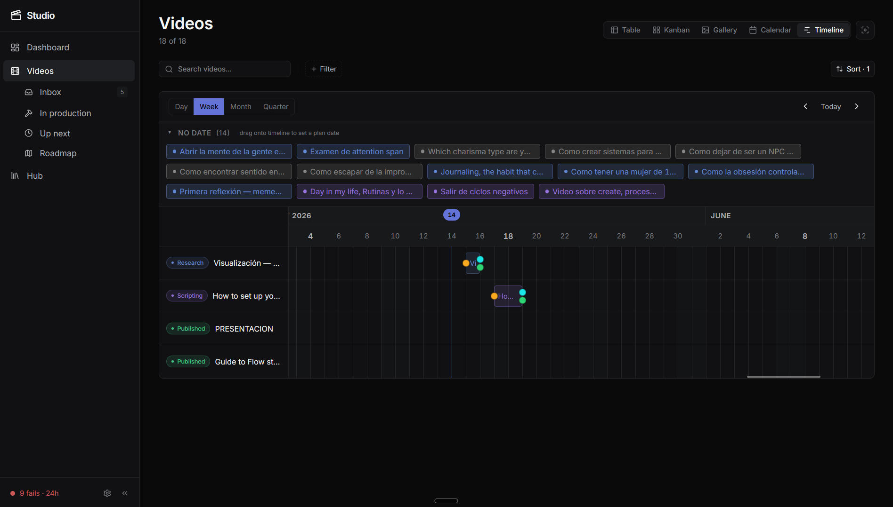
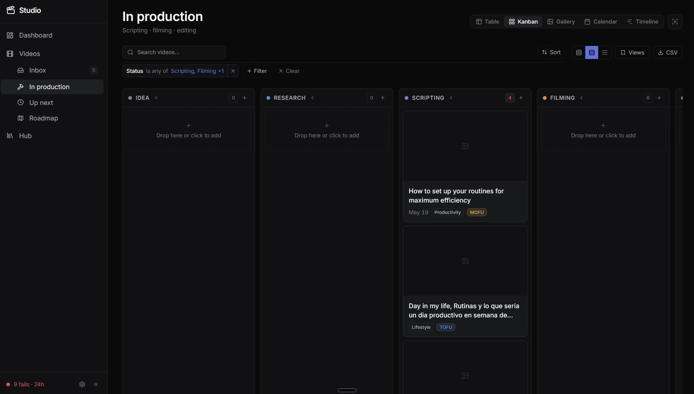
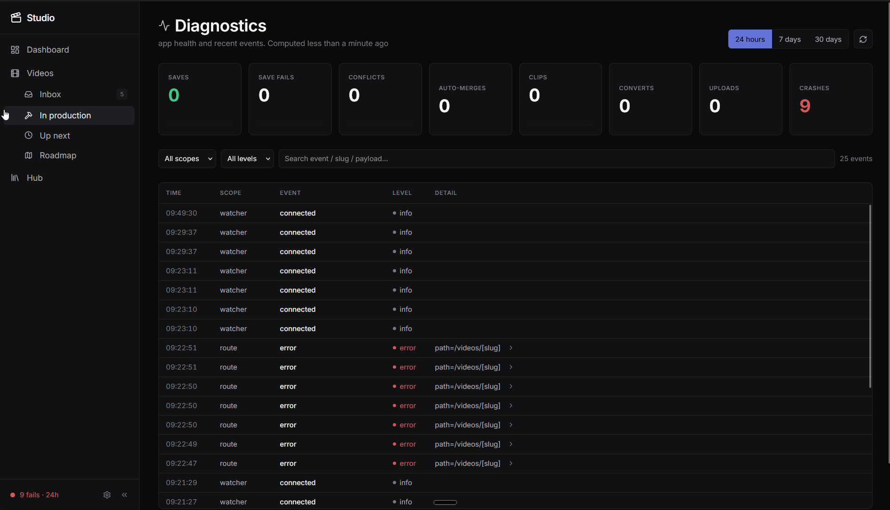

<p align="center">
  
</p>

<p align="center">
  local production dashboard for YouTube videos<br>
  script · track · ship — without leaving your vault
</p>

<p align="center">
  
  
  
  
</p>

<br>

<p align="center">
  
</p>

<br>

## what it does

`yt-studio` runs on top of your Obsidian vault. each video is a markdown file — the app reads them and gives you a full production dashboard: write scripts in a full editor, move videos through pipeline stages, schedule on a timeline, and track everything in one place.

**no cloud. no account. no subscriptions.** your files stay on your machine.

<br>

## views

<table border="0" cellspacing="0" cellpadding="4">
  <tr>
    <td width="50%">
      
      <p align="center"><sub><b>dashboard</b> — today's focus, overdue, upcoming</sub></p>
    </td>
    <td width="50%">
      
      <p align="center"><sub><b>timeline</b> — schedule videos by dragging</sub></p>
    </td>
  </tr>
  <tr>
    <td width="50%">
      
      <p align="center"><sub><b>gallery</b> — thumbnail preview at a glance</sub></p>
    </td>
    <td width="50%">
      
      <p align="center"><sub><b>diagnostics</b> — vault health and event log</sub></p>
    </td>
  </tr>
</table>

<br>

## quick start

**requirements:** [Docker](https://www.docker.com/) + an [Obsidian](https://obsidian.md/) vault

```bash
git clone https://github.com/your-username/yt-studio
cd yt-studio
docker compose up
```

Open `http://localhost:3000` and point the app at your vault in settings.

<br>

## how it works

videos live as markdown files in your vault, one file per video. frontmatter tracks status, dates, and metadata. the app reads and writes those files directly — no database, no sync, no lock-in.

```
vault/
├── ideas/
│   └── how-i-build-saas.md      # status: idea
├── in-production/
│   └── obsidian-setup-2025.md   # status: filming
└── published/
    └── my-desk-setup.md         # status: published
```

<br>

## stack

| | |
|---|---|
| **Next.js 16** | App Router, self-hosted via Docker |
| **CodeMirror 6** | Full markdown script editor with live preview |
| **dnd-kit** | Kanban drag-and-drop, timeline scheduling |
| **Tailwind CSS 4** | CSS-first config, dark only |
| **Obsidian vault** | Flat markdown files — no database required |
